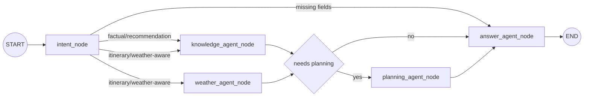

# NexTripAI-BE Repo Workflow

Repo nay la backend orchestrator cua NexTripAI. BE nhan request tu FE, dieu phoi LangGraph agent workflow, goi KB/weather tools va tra response co cau truc.

Doc chung:

- System workflow: `../docs/WORKFLOW.md`
- Repo structure: `../docs/REPO_STRUCTURE.md`
- Roadmap chung: `../docs/IMPLEMENTATION_STEPS.md`

## 1. Role In System

`NexTripAI-BE` phu trach:

- Public API cho FE.
- Chat/trip planning session state.
- Intent detection va constraint extraction.
- Knowledge Agent goi `NexTripAI-KB`.
- Weather Agent goi mock/weather provider.
- Planning Agent tao itinerary.
- Answer Agent sinh final answer.

`NexTripAI-BE` khong phu trach:

- Render UI.
- Luu raw travel data.
- Neo4j schema/index management.
- Booking/payment.
- Azure/Foundry/Teams/A2A infra.

## 2. Recommended Technical Direction

Use:

- FastAPI cho API.
- `APIRouter` de chia domain routers.
- Pydantic cho request/response schemas.
- `pydantic-settings` cho `.env`.
- LangGraph cho workflow co state, nodes va conditional edges.
- LangChain structured output cho intent extraction/answer schemas neu dung LLM.
- HTTPX cho KB/weather clients.
- Pytest cho tests.

Reference:

- LangGraph Graph API: <https://docs.langchain.com/oss/python/langgraph/graph-api>
- LangChain structured output: <https://docs.langchain.com/oss/python/langchain/structured-output>
- FastAPI APIRouter: <https://fastapi.tiangolo.com/tutorial/bigger-applications/>

## 3. Target Structure

```txt
NexTripAI-BE/
  src/
    app.py
    apis/
      routers.py
      domains/
        health/
          router.py
        chat/
          router.py
          schemas.py
          service.py
        trips/
          router.py
          schemas.py
          service.py
    config/
      settings.py
    core/
      agents/
        graph.py
        nodes.py
        schemas.py
        prompts.py
      tools/
        kb_tool.py
        weather_tool.py
        planning_tool.py
      services/
        intent_service.py
        answer_service.py
    infra/
      kb_client.py
      weather_client.py
      llm.py
      session_store.py
  tests/
```

Dependency rules:

- `core` must not import `fastapi`.
- `infra` must not import `apis`.
- `apis` can import `core` and `infra`.
- graph compile must not require live KB/weather/LLM.

## 4. Step 1 - Create Base App

Files:

- `src/app.py`
- `src/apis/routers.py`
- `src/apis/domains/health/router.py`

Behavior:

- `create_app()` returns FastAPI app.
- `include_api_routers(app)` includes domain routers.
- `GET /health` returns service status.

Run target:

```powershell
uvicorn src.app:create_app --factory --reload --port 8000
```

## 5. Step 2 - Define Config

File:

- `src/config/settings.py`

Minimum env:

```dotenv
NEXTRIP_KB_BASE_URL=http://localhost:8011
CURRENT_DATA_ENABLED=true
CURRENT_DATA_BASE_URL=http://localhost:8020
CURRENT_DATA_API_KEY=<same value as CURRENT_DATA_API_KEY on the KB runtime>
WEATHER_PROVIDER=mock
GOOGLE_API_KEY=your-google-ai-studio-key
GEMINI_CONTEXT_MODEL=gemini-flash-latest
GEMINI_ANSWER_MODEL=gemini-flash-latest
GEMINI_THINKING_LEVEL=minimal
```

Keep config local-first. Do not add Key Vault/Azure infra for this do an.

## 6. Step 3 - Define API Contracts

Chat request:

```json
{
  "message": "Goi y lich trinh 2 ngay o Da Nang cho gia dinh",
  "session_id": "session-001",
  "destination": "Da Nang",
  "duration_days": 2,
  "budget": 5000000,
  "preferences": ["family", "beach", "seafood"],
  "travel_dates": ["2026-07-20", "2026-07-21"]
}
```

Chat response:

```json
{
  "answer": "Duoi day la lich trinh goi y...",
  "intent": "itinerary_planning",
  "recommendations": [],
  "itinerary": [],
  "evidence": [],
  "missing_fields": [],
  "trace": []
}
```

Pydantic models:

- `ChatRequest`
- `ChatResponse`
- `TripPlanRequest`
- `TripPlanResponse`
- `EvidenceItem`
- `RecommendationItem`
- `ItineraryDay`

## 7. Step 4 - Create LangGraph Core

Files:

- `src/core_ai/nextrip_agent/schemas.py`
- `src/core_ai/nextrip_agent/nodes/`
- `src/core_ai/nextrip_agent/graph.py`

State:

```python
class TravelAgentState(TypedDict, total=False):
    messages: list[dict]
    intent: str
    constraints: dict
    knowledge_results: list[dict]
    weather_context: dict
    plan: dict
    answer: str
    missing_fields: list[str]
    trace_events: list[dict]
```

Nodes:

- `intent_node`
- `knowledge_agent_node`
- `weather_agent_node`
- `planning_agent_node`
- `answer_agent_node`

## 8. Step 5 - Implement Nodes In Order

### `intent_node`

Responsibilities:

- detect intent.
- extract destination, duration, budget, preferences, travel dates.
- set `missing_fields` if required info is absent.

Intent values:

- `factual_retrieval`
- `recommendation`
- `personalized_recommendation`
- `itinerary_planning`
- `weather_aware_planning`
- `clarification`

### `knowledge_agent_node`

Responsibilities:

- call KB client.
- map KB results into `knowledge_results`.
- attach evidence-friendly metadata.

### `weather_agent_node`

Responsibilities:

- use mock provider first.
- return weather context by city/date.
- fail gracefully when weather is unavailable.

### `planning_agent_node`

Responsibilities:

- receive verified candidates from GraphRAG and a live Open-Meteo forecast range.
- use Gemini structured output to select only supplied `place_id` values.
- balance activities, meals, cafe/rest breaks and hotel check-in/check-out.
- consider city, duration, current coordinates, opening hours and weather.
- validate city scope, place IDs, role/type compatibility, time overlap and weather
  suitability before exposing a structured itinerary.
- fall back to a deterministic grounded schedule if Gemini planning is unavailable
  or fails validation.

### `answer_agent_node`

Responsibilities:

- ask for missing fields when needed.
- render recommendation or itinerary.
- never invent facts outside KB evidence.
- return `answer`, `evidence`, `recommendations`, `itinerary`, `trace`.

## 9. Step 6 - Routing Defaults



Rules:

- factual/recommendation: `intent -> knowledge -> answer`.
- itinerary/weather-aware: `intent -> knowledge + weather range -> planning -> validation -> answer`.
- missing info: `intent -> answer`.
- KB failure: answer must say KB unavailable, no hallucination.
- weather failure: planning can continue with a note.

## 10. Step 7 - Create API

Endpoints:

- `GET /health`
- `POST /api/chat`
- `POST /api/trips/plan`

`POST /api/trips/plan` can call the same graph as chat, but set intent/context for itinerary planning.

## 11. Tests

Required tests:

- App smoke: `create_app()` loads and exposes `/health`, `/api/chat`, `/api/trips/plan`.
- Graph smoke: graph compiles without KB/weather/LLM live connections.
- Routing:
  - factual -> knowledge -> answer.
  - recommendation -> knowledge -> answer.
  - itinerary -> knowledge + weather -> planning -> answer.
  - missing destination/duration -> answer asks follow-up.
- KB client: parse mock `/api/kb/search` response.
- Dependency: `core` does not import `fastapi`; `infra` does not import `apis`.
